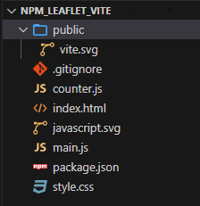
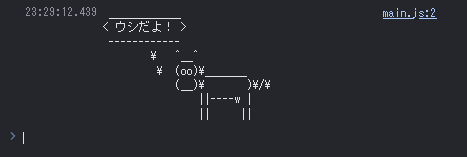
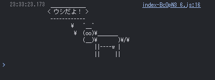

# viteでテンプレートを利用せずにVanilla JS環境を作成する

## はじめに

viteには`Vanilla JS`用のテンプレートが用意されており、簡単に使うことができます。
```bash
$ npm create vite@latest vite_project -- --template vanilla

Scaffolding project in E:\Users\tkykn\git\bundle\vite_project...

Done. Now run:

  cd vite_project
  npm install
  npm run dev
```

ただちょっとしたサンプルには不要なファイルも多いので、テンプレートを利用せずクリーンな環境を作成してみます

* --template vanilla で作成したファイル一覧

  


## viteのインストール

* npmの初期化、viteインストール
* cowsayはviteでnpmライブラリを読み込めることを確認するためにインストール

```bash
$ npm init -y
$ npm i -D vite
$ npm i cowsay
```

## npmモジュールを利用したサンプルWebアプリの作成


### main.jsの作成

viteはcommonJSをrequire()で読み込めないのでstatic importを行う
```bash
$ cat <<EOF > main.js
import * as cowsay from 'cowsay';
console.log(cowsay.say({ text: 'ウシだよ！' }));
EOF
```

### index.htmlの作成

`main.js`は絶対パスで読み込むと、viteが割り込み変換処理をしてくれる

```bash
$ cat <<EOF > index.html
<!doctype html>
<html lang="en">
  <head>
    <meta charset="UTF-8" />
    <meta name="viewport" content="width=device-width, initial-scale=1.0" />
    <title>Vite App</title>
  </head>
  <body>
    <script type="module" src="/main.js"></script>
  </body>
</html>
EOF
```

### package.jsonの修正

開発サーバーとビルドを行えるようにする

```diff_javascript:package.json
{
  "name": "vite_no_template",
  "version": "1.0.0",
  "description": "",
  "main": "index.js",
  "scripts": {
-   "test": "echo \"Error: no test specified\" && exit 1"
+   "dev": "vite",
+   "build": "vite build",
  },
  "keywords": [],
  "author": "",
  "license": "ISC",
  "devDependencies": {
    "vite": "^5.2.10"
  },
  "dependencies": {
    "cowsay": "^1.6.0"
  }
}
```

## 動作確認

### 開発サーバーを実行する

```bash
$ npm run dev
  VITE v5.2.10  ready in 160 ms

  ➜  Local:   http://localhost:5173/
  ➜  Network: use --host to expose
  ➜  press h + enter to show help
```
ブラウザで開くと、コンソールに「cowsay」が表示されていることが確認できる




### ビルドを行う

ビルドを行うと`./dist`フォルダに出力される

```bash
$ npm run dev

> vite_no_template@1.0.0 build
> vite build

vite v5.2.10 building for production...
✓ 4 modules transformed.
dist/index.html                0.29 kB │ gzip: 0.22 kB
dist/assets/index-BcOpN3_6.js  4.01 kB │ gzip: 1.99 kB
✓ built in 144ms
```

簡易http-serverを起動して表示すると、コンソールに「cowsay」が表示されていることが確認できる


```bash
$ npx http-server ./dist
Starting up http-server, serving ./dist

Available on:
  http://127.0.0.1:8080
Hit CTRL-C to stop the server
```

